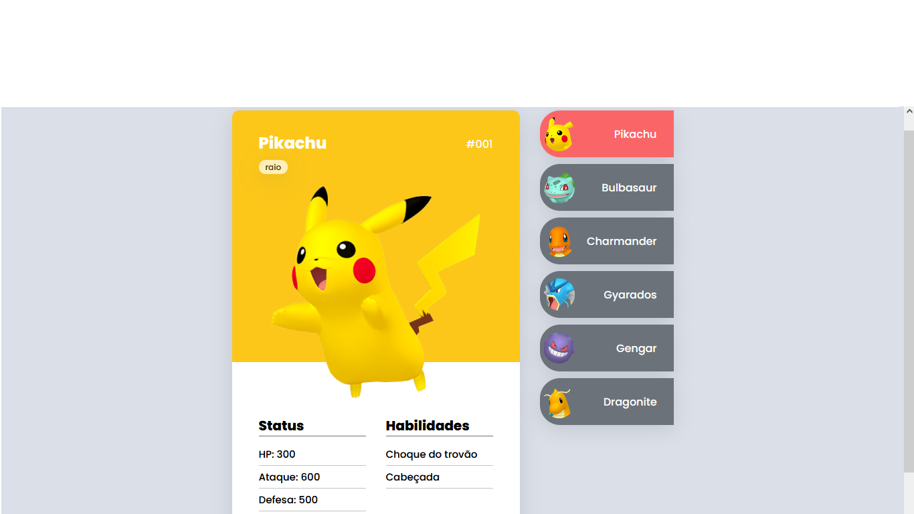

<h1 align="center">Pokedex (Dev em Dobro)</h1>

<h2 align="center">Aqui estou aprendendo e melhorando as minhas habilidades com HTML, CSS e JS.</h2>

<h2 align="center">Aprender HTML semântico e CSS bonito com responsividade é uma das minhas metas atualmente.</h2>

<h3 align="center">Primeiro episódio doprojeto(HTML): https://www.youtube.com/watch?v=GSlGO7KyX88</h3>

<h3 align="center">Segundo episódio do projeto(CSS): https://www.youtube.com/watch?v=I4UCvsvuxdo</h3>

<h3 align="center">Terceiro e último episódio do projeto(JS): https://www.youtube.com/watch?v=Iyws_6FzAWg&list=PLoL9ay7NXpXRX-lIc5LOwgOgbP_kgWDKK&index=3</h3>

<h3>Tecnologias usadas:</h3>

- HTML
- CSS
- JS

<h4 align="center">Irei colocar esse projeto em um portfólio quando eu criar um.</h4>